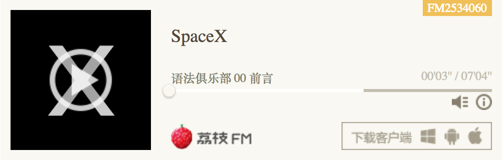

有声书《语法俱乐部》所有音频内容会定期在[**荔枝广播**](http://www.lizhi.fm/2534060/)与[**网易主播频道**](http://music.163.com/#/radio?id=350225447)以无损格式发布，计划是每天更新十分钟左右的内容在三个月内完成有声书的录制。压缩后的格式可以在 [`build`](https://github.com/li-xinyang/SS_EnglishGrammar/tree/master/build) 目录下面找到，这个项目还会用于相关笔记与资料的发布。**SpaceX** 播客可以通过**点击**或**扫描**下面的二维码找到，之后会有更多软件工程师软技能内容以音频的形式在这里发布。

<p align="center">
  <a href="http://www.lizhi.fm/2534060/">
    
  </a>
  &nbsp; &nbsp; &nbsp; &nbsp; &nbsp; &nbsp;
  <a href="http://music.163.com/#/radio?id=350225447">
    
  </a>
<p>

**五种简单的基本类型**

```
S: Subject V: Verb O: Object C: Complement

1. S + V         John Smith died.
2. S + V + O     John Smith killed a enemy soldier.
3. S + V + C     John Smith is a soldier.
4. S + V + O + O John Smith's father gave him a dog.
5. S + V + O + C John Smith's father called him a dog.
```

**定冠词与专业名次规则**

```
1. 名词短语 包括 限定词 形容词 名词 三（3）个部分，任意一个部分都可能省略
2. 如果名词短语中不用限定词，是因为该名词不适合加 a 或 an
3. a 与 an 是 one 的弱化结果，而 the 是 that 或 those 的弱化结果
```

**动词时态**

```
1. 把 Be 动词当作动词来看，句子就只剩下两种时态：一般时 与 完成时
2. 一般时 是以 括号型的时间来表达
3. 完成时 是以 箭头型的时间来表达
4. Be 动词后面的分词当作形容词补语；现在分词有正在进行的意思 过去分词有被动的意思
```

<p align="center">
  <a href="http://www.lizhi.fm/2534060/">
    
  </a>
</p>
<p align="center">
  <small>点击打开 Web 播放器</small>
</p>
<br/>

有声书所有内容来源于《语法俱乐部》（GitBook 电子书[外链]( https://zhusandiao.gitbooks.io/grammar-club/content/)，豆瓣读书[外链](https://book.douban.com/subject/1014914/)），所有版权归原作者旋元佑老师所有。所有发布有声内容均用于个人学习、研究或者欣赏为目的，请勿进行转载或用于营利。